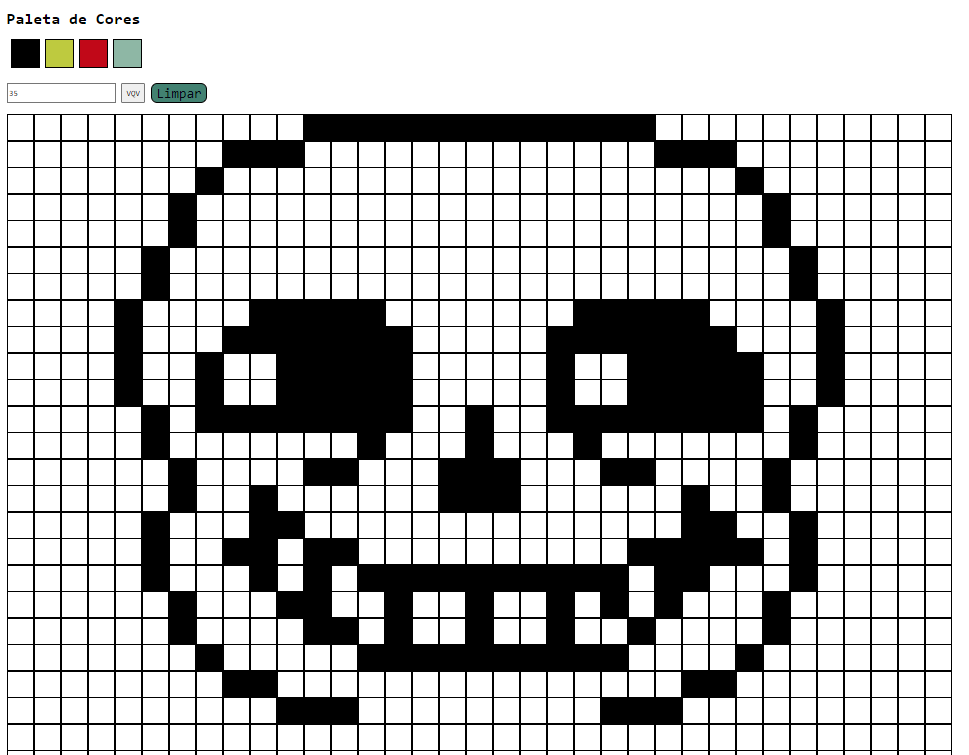

# Boas vindas ao repositório do projeto <b>Pixels Art</b>!

Esse projeto foi desenvolvido durante o módulo de Fundamentos na Trybe! #vqv 

Aqui você vai encontrar os detalhes de como foi o desenvolvimento do projeto e quais foram os requisitos técnicos necessários para a entrega do desafio.



---

# Habilidades desenvolvidas

Neste projeto, fui capaz de:

- Manipular o DOM

- Manipular o Javascript

- Inserir elementos no DOM a partir de JavaScript

---

# Funcionamento da aplicação

Para iniciar o projeto, é necessário rodar o comando
```
npm install
```
para que as dependências do projeto sejam instaladas.

Para visualizar o projeto no navegador, você pode utilizar a extensão `Live Server` do Visual Studio Code, que executará o arquivo `index.html` diretamente no navegador.

O projeto trata-se de uma grade pixelizada em que você pode escolher qualquer uma das cores da paleta e ir preenchendo para formar o desenho de sua preferência.
É possível alterar o tamanho da grade com valores entre 5x5 até 50x50, digitando o valor desejado no campo ao lado do botão `#VQV` e clicando no botão.

A paleta de cores, com exceção da cor preta, é gerada aleatoriamente a cada recarregamento da página.

---

# Requisitos técnicos do desafio:

- ✅ 1. Adicione à página o título "Paleta de Cores".

- ✅ 2. Adicione à página uma paleta de quatro cores distintas.

- ✅ 3. Adicione na página a cor preta. Ela deve ser a primeira na paleta de cores.

- ✅ 4. Adicione à página um quadro de pixels, com 25 pixels.

- ✅ 5. Faça com que cada elemento do quadro de pixels possua 40 pixels de largura, 40 pixels de altura e seja delimitado por uma borda preta de 1 pixel.

- ✅ 6. Defina a cor preta como cor inicial. Ao carregar a página, a cor preta já deve estar selecionada para pintar os pixels.

- ✅ 7. Selecione uma das cores da paleta. Ao clicar, a cor selecionada é a que será utilizada para preencher os pixels no quadro.

- ✅ 8. Clicar em um pixel dentro do quadro após selecionar uma cor na paleta, faz com que o pixel seja preenchido com a cor selecionada.

- ✅ 9. Crie um botão que, ao ser clicado, limpa o quadro preenchendo a cor de todos seus pixels com branco.

--- 

# REQUISITOS BÔNUS

- ✅ 10. Possibilite que o quadro de pixels tenha seu tamanho alterado pelo usuário.

- ✅ 11. Limite o tamanho mínimo e máximo do board.

- ✅ 12. Faça com que as cores da paleta sejam geradas aleatoriamente ao carregar a página.
